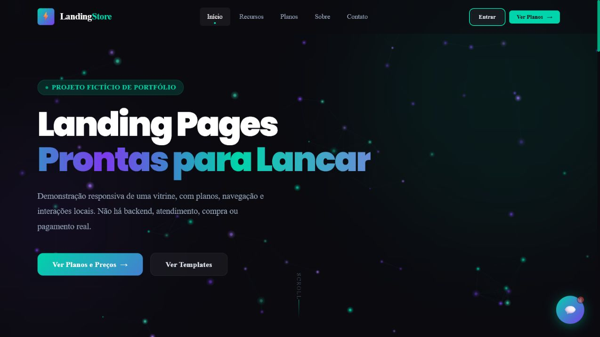

# LandingPage Store — Demo

Demonstração pública e higienizada de uma landing page para uma loja fictícia
de páginas de conversão. O projeto apresenta a experiência visual e as
interações de um produto digital sem oferecer serviços ou transações reais.

**Demo online:** <https://landing-store-taina.tainalopesgpl.chatgpt.site>



## Funcionalidades

- layout responsivo com navegação, seções de benefícios, planos e depoimentos
  fictícios;
- animações, partículas e estados interativos executados no navegador;
- assistente fictícia com respostas locais;
- fluxo demonstrativo de acesso e cadastro, armazenado apenas no navegador;
- seleção de plano e checkout inteiramente simulados;
- páginas informativas de ajuda, contato, privacidade e termos.

## Tecnologias

- HTML5, CSS3 e JavaScript sem frameworks;
- armazenamento local do navegador para estados da demonstração;
- Node.js para testes e empacotamento;
- Worker JavaScript em formato ESM para servir os arquivos estáticos.

## Limites e segurança

Este repositório é somente uma demonstração de portfólio. Não possui backend,
banco de dados, autenticação real, cobrança, pagamento ou atendimento real.
Nenhuma credencial é enviada ou processada, e todos os dados usados na
interface devem ser fictícios. As simulações acontecem localmente no navegador
e não fazem chamadas para APIs.

## Executando localmente

Requer Node.js 22 ou versão compatível.

```bash
npm test
npm run build
```

O build gera o Worker ESM em `dist/server/index.js`.

## Licença

Distribuído sob a licença MIT. Consulte [LICENSE](LICENSE).

## Autor

Tainã Lopes
